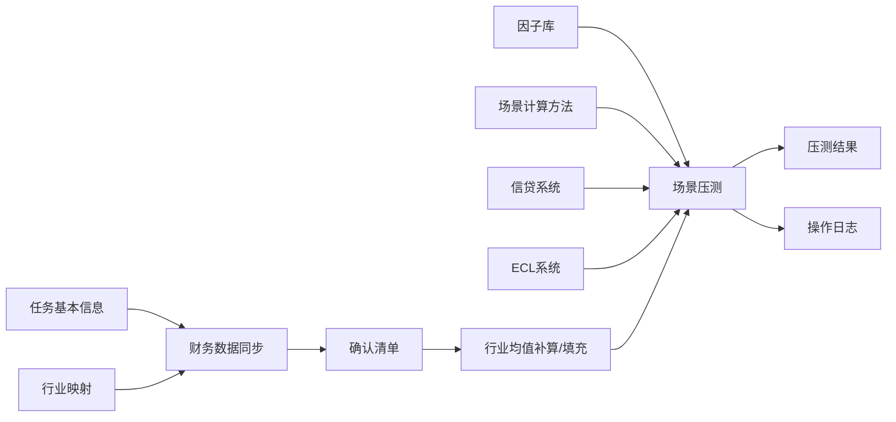

# 气候风险压测数据字段与情景口径说明（完整版）

> 依据当前 HTML 原型、`carbon-calculation-logic.js` 以及《碳排放费用与转型风险压测计算逻辑》整理。  
> 这份文档用于产品原型、接口字段、测试数据和业务口径讨论，不等同于最终监管报送模板。

## 1. 先回答：场景只有 3 种吗？

当前原始材料和原型里是 **3 种情景**：

| 情景分类 | 情景名称 | 当前是否在原型中 | 说明 |
|----------|----------|------------------|------|
| 基准情景 | 现有政策（基准） | 是 | 维持现有政策不变，作为比较基准 |
| 转型情景 | 温室世界 | 是 | 转型推进较慢，免费配额收紧幅度较低、碳价较低 |
| 转型情景 | 有序转型 | 是 | 转型推进更充分，免费配额收紧更明显、碳价更高 |

所以，**当前这版原型只内置 3 种**，依据是原始材料里「设置 1 个基准情景和 2 个转型情景」。

但从系统设计上，**不应该写死只能 3 种**。后续可以扩展为：

| 可扩展方向 | 举例 |
|------------|------|
| 更多转型情景 | 延迟转型、无序转型、净零 2050、强化政策情景 |
| 更多物理风险情景 | 急性洪涝、台风、热浪、慢性升温、干旱 |
| 更多测试年份 | 2030、2035、2040、2050 |
| 更多政策变量 | 碳价路径、免费配额路径、行业增加值增速、能源价格、CCUS 成本 |
| 更多方法版本 | V1.0、V2.0、监管版、行内版、审计回放版 |

建议页面文案可以理解为：

> 当前任务选择要执行的「压测情景」。当前版本内置 3 个情景，后续可在「场景计算方法配置」中扩展更多情景和版本。

---

## 2. 压测结果的粒度

压测结果不是「一个企业只出一个结果」。当前逻辑是：

**1 个企业样本 × 1 个情景 = 1 行压测结果**

例如：

| 企业数 | 勾选情景数 | 结果行数 |
|--------|------------|----------|
| 3 家企业 | 1 个情景 | 3 行 |
| 3 家企业 | 3 个情景 | 9 行 |
| 100 家企业 | 3 个情景 | 300 行 |

所以同一家企业可能出现多行，区别是情景不同，对应碳价、免费配额、碳排放费用、ECL 后结果不同。

---

## 3. 总体数据流

---

## 4. 任务基本信息字段

这些字段不是直接计算字段，但决定任务口径、版本和回放依据。

| 字段名 | 中文名 | 来源 | 是否必填 | 用途 |
|--------|--------|------|----------|------|
| taskName | 任务名称 | 页面填写 | 是 | 任务识别 |
| reportPeriodStart | 报告期开始日期 | 页面填写 | 是 | 确定财务数据期间 |
| reportPeriodEnd | 报告期结束日期 | 页面填写 | 是 | 推荐因子版本、确定数据期间 |
| dataCaliber | 数据口径 | 页面填写 | 否 | 合并报表 / 母公司 / 单体报表 |
| factorVersion | 因子版本 | 页面选择 | 是 | 锁定任务使用的因子库版本 |
| mappingVersion | 映射版本 | 系统带入 | 建议必填 | 锁定行业映射口径 |
| scenarioVersion | 场景公式版本 | 系统带入 | 建议必填 | 锁定场景公式版本 |
| description | 任务说明 | 页面填写 | 否 | 补充任务范围、假设说明 |
| status | 当前步骤/状态 | 系统生成 | 是 | 控制流程流转 |
| createdAt / updatedAt | 创建/更新时间 | 系统生成 | 是 | 审计留痕 |

说明：任务编号可以后台保留，但界面可不展示。

---

## 5. 财务数据字段（同步财务数据）

财务数据是压测最核心的输入，按「企业/客户」一条记录。

### 5.1 页面清单字段

| 字段名 | 中文名 | 来源 | 是否必填 | 说明 |
|--------|--------|------|----------|------|
| companyName | 公司 | 财务系统/客户主数据 | 是 | 借款企业名称 |
| customerId | 客户号 | 客户主数据 | 建议必填 | 与信贷、ECL 匹配更稳定 |
| unifiedSocialCreditCode | 统一社会信用代码 | 客户主数据 | 建议必填 | 跨系统匹配备用键 |
| branchName | 分行 | 信贷/客户系统 | 是 | 管户机构 |
| branchCode | 分行代码 | 信贷/机构系统 | 建议必填 | 统计汇总用 |
| apiIndustry | 接口行业 | 财务/客户系统 | 是 | 原始行业名称或代码 |
| gbIndustryCode | 国标行业代码 | 行业映射/客户系统 | 建议必填 | 如 C2614、D4411 |
| standardIndustry | 标准行业 | 行业映射 | 映射成功必填 | 化工、钢铁、电力等 |
| dataAvailability | 状态 | 系统判定 | 是 | 可使用 / 需计算 / 无法处理 |
| availabilityReason | 原因 | 系统判定 | 是 | 数据完整、关键指标缺失、行业未映射等 |
| dataSource | 数据来源 | 系统生成 | 是 | 接口原始 / 行业均值补算 |

### 5.2 财务报表字段（建议接口字段）

| 字段名 | 中文名 | 是否必填 | 当前原型是否使用 | 用途 |
|--------|--------|----------|------------------|------|
| revenue | 营业收入(万) | 是 | 是 | 推算排放、碳费、收入后结果 |
| operatingCost | 营业成本(万) | 建议 | 否 | 可计算成本收入比 |
| operatingExpense | 营业支出(万) | 建议 | 否 | 可替代成本收入比直接入模 |
| costIncomeRatio | 成本收入比 | 是/可计算 | 是 | 高碳行业支出 = 收入×成本收入比 + 碳费 |
| ebitda | EBITDA(万) | 建议 | 行业均值展示 | 经营能力指标，可扩展入模 |
| profitBeforeTax | 利润总额(万) | 建议 | 可扩展 | 计算净利润前状态 |
| netProfit | 净利润(万) | 建议 | 可扩展 | 判断 CCUS 条件、资产端调整 |
| totalAssets | 资产总计(万) | 建议 | 违约判断预留 | 资产负债率与违约判定 |
| totalLiabilities | 负债合计(万) | 建议 | 可扩展 | 计算资产负债率 |
| assetLiabilityRatio | 资产负债率 | 建议 | 是（可选） | 违约判定 |
| currentAssets | 流动资产(万) | 扩展 | 否 | 资产端冲击分配 |
| cash | 货币资金(万) | 扩展 | 否 | 净利润为负时优先抵扣 |
| notesReceivable | 应收票据(万) | 扩展 | 否 | 资产端调整 |
| accountsReceivable | 应收账款(万) | 扩展 | 否 | 资产端调整 |
| inventory | 存货(万) | 扩展 | 否 | 资产端调整 |
| fixedAssets | 固定资产(万) | 扩展 | 否 | 流动资产抵扣完后折价抵扣 |
| ownersEquity | 所有者权益(万) | 扩展 | 否 | 净利润计入留存收益 |
| baseNetProfitPositive | 基期净利润是否为正 | 建议 | 是（可选） | CCUS 碳价封顶资格 |

### 5.3 碳排放相关字段

| 字段名 | 中文名 | 是否必填 | 当前原型是否使用 | 用途 |
|--------|--------|----------|------------------|------|
| baseCarbonEmission | 基期碳排放量(吨) | 有则优先 | 是（可选） | 有企业排放数据时计算企业因子 |
| basePeriodRevenue | 基期收入(百万元/万，需统一单位) | 有排放时必填 | 是（可选） | 企业因子 = 基期排放 ÷ 基期收入 |
| emissionFactorCode | 排放因子编码 | 建议 | 是 | 精确匹配因子库 |
| industryEmissionFactor | 行业排放因子 | 系统带入 | 间接使用 | 无企业排放数据时使用 |
| passengerThroughput | 机场旅客吞吐量(万人次) | 机场类必填 | 是（可选） | 机场按吞吐量口径算排放 |

---

## 6. 行业映射字段

用于把接口行业映射到标准高碳行业。

| 字段名 | 中文名 | 是否必填 | 说明 |
|--------|--------|----------|------|
| apiIndustry | 接口行业 | 是 | 外部系统传入行业 |
| standardIndustry | 标准行业 | 是 | 电力、建材、钢铁、石化、化工、造纸、航空、有色等 |
| gbCode | 国标代码 | 建议 | GB/T 4754 行业代码 |
| mappingType | 映射类型 | 否 | GB/T4754、多对一、人工维护等 |
| version | 版本 | 是 | 任务需锁定版本 |
| status | 状态 | 是 | 已启用/已停用 |
| updatedAt | 更新时间 | 是 | 变更追溯 |

无映射时，企业样本状态为 **无法处理**。

---

## 7. 因子库字段

当前原型使用「行业碳排放因子」。

| 字段名 | 中文名 | 是否必填 | 说明 |
|--------|--------|----------|------|
| factorCode | 因子编码 | 是 | 如 EMISSION_C2614 |
| factorName | 因子名称 | 是 | 如 化工-有机原料 |
| gbCode | 国标代码 | 建议 | 如 C2614 |
| industry | 行业大类 | 是 | 标准行业 |
| subType | 细分类型 | 建议 | 如 燃煤发电、浮法玻璃 |
| factorValue | 因子值 | 是 | 数值 |
| unit | 单位 | 是 | tCO2e/百万元、tCO2e/万人次等 |
| version | 版本 | 是 | 如 V2.0-行内方法 |
| status | 状态 | 是 | 已启用/停用 |
| effectiveFrom | 生效日期 | 建议 | 版本管理 |
| updatedAt | 更新时间 | 建议 | 审计 |

当前内置高碳大类包括：电力、建材、钢铁、石化、化工、造纸、航空、有色。

---

## 8. 行业均值字段

当财务数据缺少收入/EBITDA 等关键指标，但行业可映射时，进入「需计算」。

| 字段名 | 中文名 | 是否必填 | 说明 |
|--------|--------|----------|------|
| industry | 标准行业 | 是 | 例如电力、建材 |
| sampleCount | 样本数 | 是 | 参与均值计算的样本数 |
| avgRevenue | 均值-收入(万) | 是 | 用于填充缺失收入 |
| avgEbitda | 均值-EBITDA(万) | 建议 | 用于补充经营指标 |
| calcBasis | 计算依据 | 建议 | 已确认、可使用样本 |
| calcTime | 计算时间 | 建议 | 留痕 |
| fillStatus | 填充状态 | 是 | 未填充/已填充 |

填充后样本状态变更为 **可使用**，顶部统计也要同步变化。

---

## 9. 信贷数据字段

当前原型调取信贷数据后展示，并作为执行压测前置条件。实际业务上信贷数据应更完整。

| 字段名 | 中文名 | 是否必填 | 当前原型是否使用 | 用途 |
|--------|--------|----------|------------------|------|
| companyName | 公司 | 是 | 是 | 匹配企业 |
| customerId | 客户号 | 建议必填 | 否 | 稳定匹配键 |
| loanAccountNo | 借据号/贷款账号 | 建议 | 否 | 明细级压测时使用 |
| contractNo | 合同号 | 建议 | 否 | 追溯合同 |
| loanBalance | 贷款余额(万) | 是 | 展示 | 敞口规模，后续可计算不良/ECL影响 |
| creditExposure | 授信敞口(万) | 建议 | 否 | 授信维度汇总 |
| productType | 产品类型 | 建议 | 否 | 流贷、项目贷、银承等 |
| currency | 币种 | 建议 | 否 | 多币种处理 |
| startDate | 起息日 | 建议 | 否 | 剩余期限计算 |
| maturityDate | 到期日 | 建议 | 否 | 剩余期限、期限桶 |
| remainingTenor | 剩余期限(月) | 建议 | 否 | 期限维度风险 |
| interestRate | 利率 | 扩展 | 否 | 收益影响测算 |
| rating | 客户评级 | 是 | 展示 | 风险水平 |
| classification | 五级分类 | 是 | 展示 | 正常/关注/次级等 |
| guaranteeType | 担保方式 | 建议 | 展示 | 抵押、保证、信用 |
| collateralValue | 押品价值(万) | 扩展 | 否 | LGD 估计扩展 |
| branchName / branchCode | 分支机构 | 是 | 展示 | 机构汇总 |

---

## 10. ECL 数据字段

当前原型主要使用 `eclAmount` 作为压测前 ECL，其他字段展示。

| 字段名 | 中文名 | 是否必填 | 当前原型是否使用 | 用途 |
|--------|--------|----------|------------------|------|
| companyName | 公司 | 是 | 是 | 匹配企业 |
| customerId | 客户号 | 建议必填 | 否 | 稳定匹配 |
| loanAccountNo | 借据号 | 建议 | 否 | 明细级匹配 |
| pd | PD | 是 | 展示 | 违约概率 |
| lgd | LGD | 是 | 展示 | 违约损失率 |
| ead | EAD | 是 | 展示 | 风险暴露 |
| stage | 减值阶段 | 是 | 展示 | 一阶段/二阶段/三阶段 |
| eclAmount | ECL金额(万) | 是 | 是 | 压测前 ECL，即 eclBefore |
| provision | 拨备余额(万) | 建议 | 否 | 拨备影响扩展 |
| modelVersion | ECL模型版本 | 建议 | 否 | 审计回放 |
| measurementDate | 计量日期 | 建议 | 否 | 与报告期匹配 |
| ratingBefore | 压测前评级 | 扩展 | 否 | 迁徙分析 |
| pdTermStructure | PD期限结构 | 扩展 | 否 | 多期ECL扩展 |

当前原型简化：

`ECL后 = ECL前 × (1 + min(影响率 × 2, 0.5))`

实际生产系统可改为：气候冲击 → 财务指标变化 → 评级迁徙/PD上调 → ECL重算。

---

## 11. 场景配置字段

场景不是固定只能 3 个，系统应按配置驱动。当前原型内置 3 个。

| 字段名 | 中文名 | 是否必填 | 说明 |
|--------|--------|----------|------|
| scenarioCode | 场景编码 | 是 | BASELINE、GREENHOUSE_WORLD 等 |
| scenarioName | 场景名称 | 是 | 现有政策、温室世界、有序转型 |
| scenarioType | 场景类型 | 是 | TRANSITION / PHYSICAL / COMBINED |
| version | 版本 | 是 | 任务锁定版本 |
| status | 状态 | 是 | 草稿/已生效/停用 |
| publishedAt | 生效时间 | 是 | 发布留痕 |
| testYear | 测试年 | 建议 | 默认 2040，可扩展 2030/2035/2050 |
| baseYear | 基期年份 | 建议 | 如 2025 |
| formula | 公式说明 | 是 | 公式文本 |
| inputFields | 输入字段 | 是 | 公式依赖字段 |
| outputFields | 输出字段 | 是 | 结果输出字段 |
| freeQuota2025 | 2025免费配额 | 转型情景必填 | 当前为 100% |
| freeQuota2040 | 2040免费配额 | 转型情景必填 | 当前三情景不同 |
| carbonPrice2025 | 2025碳价 | 转型情景必填 | 当前 80 元/吨 |
| carbonPrice2040 | 2040碳价 | 转型情景必填 | 当前三情景不同 |
| revenueGrowthPath | 收入/行业增加值增速路径 | 建议 | 当前原型默认 2% |
| costPassThrough | 成本转嫁能力 | 建议 | 原始口径：不具备议价能力，无法转嫁 |
| ccusEnabled | 是否考虑CCUS | 建议 | 可用于碳价上限 |
| ccusPriceCap | CCUS成本上限 | 建议 | 当前逻辑 500 元/吨 |
| physicalHazardType | 物理风险类型 | 物理风险必填 | 洪涝、台风、热浪等 |
| physicalDamageRate | 物理损失率 | 物理风险必填 | 资产/收入冲击比例 |

### 11.1 当前内置 3 个情景

| 情景编码 | 情景名称 | 类型 | 2025免费配额 | 2040免费配额 | 2025碳价 | 2040碳价 |
|----------|----------|------|--------------|--------------|----------|----------|
| BASELINE | 现有政策（基准） | TRANSITION | 100% | 75% | 80 | 150 |
| GREENHOUSE_WORLD | 温室世界 | TRANSITION | 100% | 85% | 80 | 120 |
| ORDERLY_TRANSITION | 有序转型 | TRANSITION | 100% | 55% | 80 | 200 |

### 11.2 后续可扩展情景示例

| 情景名称 | 类型 | 可能新增参数 |
|----------|------|--------------|
| 延迟转型 | TRANSITION | 前期碳价低、后期快速上升 |
| 无序转型 | TRANSITION | 碳价跳升、免费配额突然下降 |
| 净零 2050 | TRANSITION | 更长测试期、更陡峭减排路径 |
| 洪涝灾害 | PHYSICAL | 地区、资产损失率、停工天数 |
| 高温热浪 | PHYSICAL | 行业产能下降、用电成本上升 |
| 综合情景 | COMBINED | 转型参数 + 物理损失参数 |

---

## 12. 当前转型压测计算字段链条

### 12.1 输入字段

| 字段 | 来源 | 说明 |
|------|------|------|
| revenue | 财务 | 基期营业收入 |
| revenueGrowth | 场景/系统默认 | 当前默认年增速 2% |
| standardIndustry | 财务+映射 | 行业大类 |
| gbIndustryCode | 财务+映射 | 匹配因子 |
| emissionFactorCode | 因子库 | 优先匹配因子 |
| costIncomeRatio | 财务 | 成本收入比 |
| baseCarbonEmission | 财务/碳数据 | 有则算企业专属因子 |
| basePeriodRevenue | 财务/碳数据 | 与基期排放配套 |
| passengerThroughput | 业务数据 | 机场类使用 |
| freeQuotaRatio | 场景 | 按测试年插值 |
| carbonPrice | 场景 | 按测试年插值 |
| eclAmount | ECL | 压测前 ECL |
| assetLiabilityRatio | 财务 | 违约判断 |
| totalAssets | 财务 | 违约判断 |

### 12.2 中间计算字段

| 字段 | 说明 |
|------|------|
| revenueProjected | 测试年收入 |
| emissionFactorUsed | 使用的排放因子 |
| carbonEmission | 碳排放量 |
| payableRatio | 应付配额比例 = 1 - 免费配额 |
| effectiveCarbonPrice | 考虑CCUS上限后的有效碳价 |
| carbonCost | 碳排放费用 |
| operatingExpense | 营业支出 |
| profitBeforeTax | 利润总额 |
| netProfitAfter | 税后净利润 |
| alrAfter | 压测后资产负债率（生产系统建议输出） |
| impactRate | 影响率 |

### 12.3 输出字段

| 字段 | 当前结果页展示 | 说明 |
|------|----------------|------|
| companyName | 是 | 公司 |
| branchName | 是 | 分行 |
| standardIndustry | 是 | 行业 |
| scenarioCode | 否 | 情景编码，建议导出 |
| scenarioName | 是 | 情景名称 |
| testYear | 否 | 测试年，建议导出 |
| revenueBefore | 是 | 收入前 |
| revenueAfter | 是 | 收入后 |
| carbonEmission | 是 | 碳排放量 |
| carbonCost | 是 | 碳排放费用 |
| freeQuotaRatio | 否 | 免费配额，建议导出 |
| carbonPrice | 否 | 碳价，建议导出 |
| eclBefore | 是 | ECL前 |
| eclAfter | 是 | ECL后 |
| eclDelta | 否 | ECL增量 = 后 - 前，建议新增 |
| impactRate | 是 | 影响率 |
| netProfitAfter | 否 | 压测后净利润，建议导出 |
| defaultFlag | 是 | 是否违约 |
| emissionFactorUsed | 否 | 使用因子编码，建议导出 |
| dataSource | 否 | 接口原始/行业均值补算，建议导出 |

---

## 13. 物理风险字段（当前原型未实现，但建议预留）

如果未来加入洪涝、台风、高温等物理风险，需要增加：

| 字段 | 来源 | 说明 |
|------|------|------|
| companyAddress | 客户地址 | 定位风险区域 |
| province / city / district | 客户地址 | 地区汇总 |
| longitude / latitude | 地理编码 | 灾害暴露匹配 |
| collateralAddress | 押品地址 | 押品物理风险 |
| collateralType | 押品类型 | 房产、厂房、机器设备等 |
| collateralValue | 押品价值 | 损失估计 |
| hazardType | 场景 | 洪涝、台风、热浪、干旱 |
| hazardIntensity | 场景 | 灾害强度 |
| damageRate | 场景/模型 | 资产损失率 |
| businessInterruptionDays | 场景/模型 | 停工天数 |
| revenueLossRate | 模型 | 收入损失比例 |
| collateralHaircut | 模型 | 押品折价比例 |

物理风险结果可新增：资产损失、收入损失、押品价值下降、LGD上升、ECL增加。

---

## 14. 综合风险字段（转型 + 物理）

综合情景建议输出：

| 字段 | 说明 |
|------|------|
| transitionCarbonCost | 转型风险碳费 |
| physicalAssetLoss | 物理风险资产损失 |
| physicalRevenueLoss | 物理风险收入损失 |
| combinedRevenueAfter | 综合冲击后收入 |
| combinedEclAfter | 综合冲击后ECL |
| dominantRiskType | 主导风险类型：转型/物理/共同 |

---

## 15. 汇总分析字段

结果分析页目前按行业/分行汇总。建议字段：

| 字段 | 说明 |
|------|------|
| dimensionType | 维度：行业/分行/情景/评级 |
| dimensionName | 维度名称 |
| companyCount | 公司数 |
| exposureTotal | 贷款余额合计 |
| eclBeforeTotal | ECL前合计 |
| eclAfterTotal | ECL后合计 |
| eclDeltaTotal | ECL增量合计 |
| avgImpactRate | 平均影响率 |
| maxImpactRate | 最大影响率 |
| defaultCount | 违约户数 |
| defaultExposure | 违约敞口 |
| highRiskCompanyCount | 高风险客户数 |

---

## 16. 导出记录字段

| 字段 | 说明 |
|------|------|
| taskName | 任务名称 |
| exportType | 表格/图表/报告 |
| fileFormat | Excel/PDF/CSV |
| scope | 公司明细、行业汇总、分行维度等 |
| fields | 导出字段 |
| operator | 导出人 |
| exportedAt | 导出时间 |
| fileName | 文件名（建议新增） |
| fileHash | 文件哈希（审计建议） |

---

## 17. 操作日志字段

| 字段 | 说明 |
|------|------|
| taskId | 任务ID |
| time | 操作时间 |
| operator | 操作人 |
| action | 操作内容 |
| beforeStatus | 操作前状态（建议新增） |
| afterStatus | 操作后状态（建议新增） |
| detail | 操作详情（建议新增） |

当前已记录：创建任务、编辑任务、同步财务数据、确认清单、计算行业均值、填充数据、调取信贷、调取ECL、开始压测、压测完成、导出、归档等。

---

## 18. 字段依赖关系

| 缺少字段 | 影响 |
|----------|------|
| companyName / customerId | 难以跨系统匹配 |
| apiIndustry / standardIndustry | 无法选行业因子 |
| revenue | 无法计算碳排放和碳费 |
| costIncomeRatio | 无法计算高碳行业支出，需默认值 |
| emissionFactorCode / gbIndustryCode | 因子匹配不准 |
| eclAmount | 无法得到准确 ECL前 |
| 信贷数据 | 当前页面不允许压测，生产也无法评估敞口影响 |
| 场景参数 | 无法确定碳价、免费配额 |
| 需计算未填充 | 样本不能进入压测 |
| 无法处理未处理 | 不能确认清单 |

---

## 19. 建议最小必填字段清单

如果先做一期上线，建议最小字段如下：

### 财务/客户最小字段

| 字段 | 说明 |
|------|------|
| companyName | 公司 |
| customerId | 客户号 |
| branchName / branchCode | 分行 |
| apiIndustry | 原始行业 |
| standardIndustry 或 gbIndustryCode | 标准行业/国标代码 |
| revenue | 营业收入 |
| costIncomeRatio | 成本收入比 |

### 信贷最小字段

| 字段 | 说明 |
|------|------|
| customerId / companyName | 匹配键 |
| loanBalance | 贷款余额 |
| rating | 评级 |
| classification | 五级分类 |
| guaranteeType | 担保方式 |

### ECL最小字段

| 字段 | 说明 |
|------|------|
| customerId / companyName | 匹配键 |
| pd | PD |
| lgd | LGD |
| ead | EAD |
| stage | 阶段 |
| eclAmount | ECL金额 |

### 场景最小字段

| 字段 | 说明 |
|------|------|
| scenarioCode | 情景编码 |
| scenarioName | 情景名称 |
| freeQuota2025 / freeQuota2040 | 免费配额路径 |
| carbonPrice2025 / carbonPrice2040 | 碳价路径 |
| testYear | 测试年 |
| formulaVersion | 公式版本 |

---

## 20. 页面与字段对应

| 页面/步骤 | 字段范围 |
|-----------|----------|
| 创建任务 | 任务基本信息、版本字段 |
| 数据同步与确认 | 财务/客户字段、状态分流 |
| 行业均值 | 缺失字段补算、均值字段 |
| 场景压测 | 信贷、ECL、场景选择 |
| 压测结果 | 企业 × 情景 结果字段 |
| 因子库管理 | 行业排放因子 |
| 场景计算方法配置 | 场景参数、公式版本 |
| 行业映射关系 | 行业标准化映射 |
| 导出记录 | 导出留痕 |
| 操作日志 | 流程操作留痕 |

---

## 21. 结论

1. **当前原型只有 3 个情景**，因为原始材料就是「1 个基准情景 + 2 个转型情景」。
2. **系统设计不应限制只能 3 个**，后续应支持在「场景计算方法配置」里新增更多转型、物理、综合情景。
3. 当前最核心的计算字段是：`revenue`、`standardIndustry/gbIndustryCode`、`emissionFactorCode`、`costIncomeRatio`、`eclAmount`、`scenarioCode`、`freeQuotaRatio`、`carbonPrice`。
4. 结果粒度是 **企业 × 情景**，不是企业只能选一个情景。

*文档版本：2026-06-04；与当前完整版 HTML 原型及行内计算逻辑文档对齐。*
